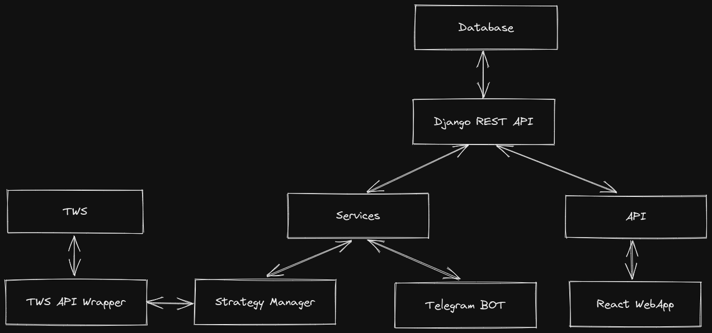

# Automated trading strategies using Interactive Brokers TWS API, Django REST, React and Telegram

The more people using the same strategy, the overall less efficient it become.
This is why building your own tools could make stand out your trading strategies.
I have developed a fully custom trading bot, making use of the following technologies:

* TWS API (Interactive Brokers Trading Workstation API)
* Trading View
* Django REST
* React
* Telegram

  

  Here's a video which shows the application running.

  `youtube: https://youtu.be/hR5kvTo0jtU`